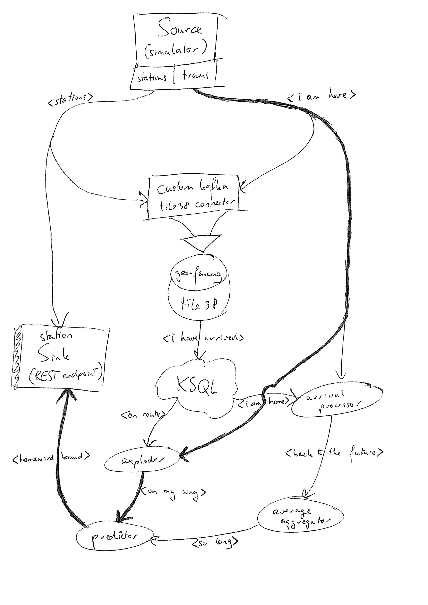

# Train of Thought
Named after the brilliant lumosity game.

<what it does - what it contributes to mankind>. It is a simple programming experiment with as underlying purpose to show (to anyone who'd like to see) how we can transform and manipulate data (streams) into useful and thus valuable information. For this reason, and to allow it to coordinate any transportation monitoring system without complex interfacing, only a minimum (too little really) of input data is required for it to function: train and stations; even the train routs are deduced! Its architecture is highly scalable, and with the right ops-people it could monitor the entire public transportation system of any country.  

The unconventional and unprofessional (kafka topic, mvn module, and class) names are chosen to facilitate communicating the app's inner workings to my wife :) 

## Inner Workings

<add links to separate readme files>
* [source](source/README.md)
* [kafka connector](https://github.com/LeonardoBonacci/kafka-connect-tile38-sink/blob/master/README.md)
* [KSQL queries](ksql/README.md)
* [exploder](exploder/README.md)
* [predictor](predictor/README.md)
* [station-sink](station-sink/README.md)
* [arrival-processor](arrival-processor/README.md)
* [averager](averager/README.md)
	
## Custom Kafka Connector
Use these configuration ....
* Go to localhost:3030 - Connectors etc., check  logs and topics
* Sometimes it's necessary to restart 'source' after you've first setup the connectors. This in order to read the stations topic from the beginning.
* docker-compose stop source ; docker-compose start source
	
## Run Me
* docker run --net=host -it tile38/tile38 tile38-cli
* SETHOOK trains_at_stations kafka://host.docker.internal:9092/I_HAVE_ARRIVED NEARBY trains FENCE ROAM stations * 50

* docker-compose exec ksql-cli ksql http://ksql-server:8088
* SET 'auto.offset.reset'='earliest';
* SET 'ksql.sink.partitions'='1';
* PRINT i_have_arrived FROM BEGINNING;

CREATE STREAM i_have_arrived_src (id STRING,
							time STRING,
							fields STRUCT<route INT>,
			                 		nearby STRUCT<
				                    	  	key STRING,
				                      	  	id STRING,
				                      	  	object STRING,
				                      		meters INT>)
        WITH (KAFKA_TOPIC='I_HAVE_ARRIVED', VALUE_FORMAT='JSON');

CREATE STREAM i_am_home AS 	SELECT id, time as moment, mystringtoint(nearby->id) as station 
						 	FROM i_have_arrived_src 
						 	WHERE nearby IS NOT NULL 
						 	PARTITION BY id;

CREATE STREAM on_route AS SELECT fields->route AS route, mystringtoint(nearby->id) AS station 
							FROM i_have_arrived_src 
						 	WHERE nearby IS NOT NULL
						 	PARTITION BY route;

* If all services are running and your laptop can handle a bit more, launch two sink container to check out the load balancing
* docker-compose stop sink
* docker-compose up -d --scale sink=3 
* Now query the REST endpoint, first to find the machine name, then to query the data:
* docker run --tty --rm -i --network ks debezium/tooling:1.0
* http sink:8080/train-stations/meta-data
* http --follow 96b52c724a8d:8080/train-stations/data/1
* or, forget about the scaling and just run http sink:8080/train-stations/data/1

## TODO
* simplify setup by adding docker-compose instructions 
* use KTable instead of GlobalKTable in 'station-sink' and 'predictor' services
* make train simulator of wellington
* tune partitions
* compile services to executables and 'sync' with partitions
* tests

## Useful Resoures
* https://lordofthejars.github.io/quarkus-cheat-sheet/
* https://www.udemy.com/course/java-application-performance-and-memory-management/
* https://www.udemy.com/course/a-comprehensive-introduction-to-java-virtual-machine-jvm/
* https://www.udemy.com/course/jvm-security-the-java-sandbox-model/
* https://medium.com/@coderunner/debugging-with-kafkacat-df7851d21968
* https://medium.com/test-kafka-based-applications/https-medium-com-testing-kafka-based-applications-85d8951cec43
* https://www.testcontainers.org/
* https://sookocheff.com/post/kafka/kafka-in-a-nutshell/
* https://blog.newrelic.com/engineering/apache-kafka-event-processing/ 
* https://blog.newrelic.com/engineering/effective-strategies-kafka-topic-partitioning/
* https://docs.confluent.io/current/app-development/kafkacat-usage.html
* https://berlinbuzzwords.de/sites/berlinbuzzwords.de/files/media/documents/geo-analytics-with-kafka-v1.0.pdf
* https://www.confluent.io/blog/build-udf-udaf-ksql-5-0
* https://github.com/gschmutz/various-demos/tree/master/kafka-geofencing
* https://quarkus.io/guides/kafka-streams-guide
* https://github.com/quarkusio/quarkus-quickstarts
* https://docs.confluent.io/current/ksql/docs/developer-guide/query-with-structured-data.html
* https://www.confluent.io/blog/data-wrangling-apache-kafka-ksql
* https://dev.to/skhmt/creating-a-native-executable-in-windows-with-graalvm-3g7f
* http://karols.github.io/blog/2019/05/12/native-image-on-windows-10-x64/
* https://redis.io/topics/protocol
* https://tile38.com/
* https://github.com/lettuce-io/lettuce-core/wiki/Custom-commands,-outputs-and-command-mechanics
* https://tile38.com/topics/replication/
* https://docs.confluent.io/current/ksql/docs/installation/install-ksql-with-docker.html 
* https://dev.to/skhmt/creating-a-native-executable-in-windows-with-graalvm-3g7f
* https://medium.com/graalvm/libgraal-graalvm-compiler-as-a-precompiled-graalvm-native-image-26e354bee5c
* https://www.infoq.com/presentations/graalvm-performance/
* http://karols.github.io/blog/2019/05/12/native-image-on-windows-10-x64/
* https://docs.confluent.io/current/ksql/docs/developer-guide/create-a-stream.html
* https://medium.com/@jponge/the-graalvm-frenzy-f54257f5932c
* https://hackernoon.com/why-the-java-community-should-embrace-graalvm-abd3ea9121b5
* https://chrisseaton.com/truffleruby/tenthings/

## Disclaimer

This repo is honoured to be forked. If you encounter any difficulties running it, and believe me you will (at this stage), let me know and I'll try to help you out.
